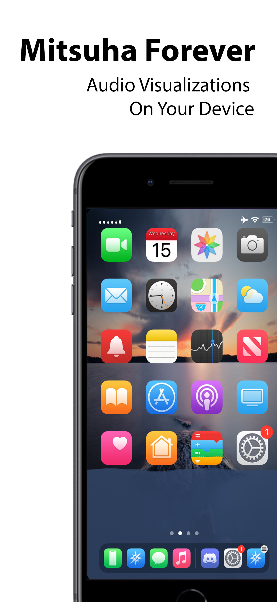
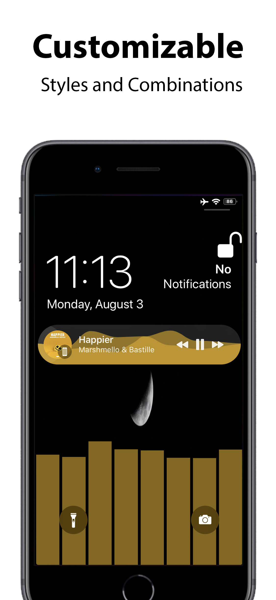
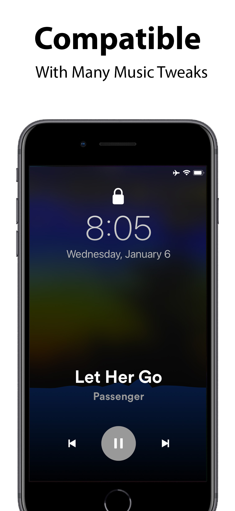

#  Mitsuha Forever - Universal iOS Music Visualizer

This is a fork of a Nepeta's excellent tweak - [MitsuhaInfinity](https://github.com/Nepeta/MitsuhaInfinity) with support for iOS 15.7, bug fixes and new features.

For support / to report a bug [join my discord server](https://discord.gg/J2Tmaqy)

## Features:
* Waveform with frequency instead of amplitude
* Custom visualization appearance settings
* Custom the number of visualizer points and attributes
* Custom dynamic, Siri, and custom color styles
* Custom color alphas
* Custom positioning
* Custom visualizer speed and sensitivity

## Getting started:

Please make sure that your device is jailbroken and a package manager such as Zebra or Cydia is installed before installing the tweak.
If your device is not jailbroken, please refer to this link to get started: https://ios.cfw.guide/

## Installation

1. Add this repository to your package manager: https://repo.chariz.com
2. Install **Mitsuha Forever**.

## Compatibility

### Supported apps

* Apple Music
* Spotify
* Soundcloud
* iOS audio player notification (global)

### Supported iOS versions and devices

* Compatible with iPhone, iPad, and iPod touch running iOS 12.0 to 15.7.

### Tweaks

Should be compatible with Eclipse and similar tweaks.
Works with Artsy.

## How to use

After installing the tweak, you can customize your preferences in the Settings app.
[Settings page](mitsuha_forever_tweak.625x0-is.jpg)

# Code contributions

Pull requests are welcome!
You can start by cloning this repo and build the tweak by using Theos: https://theos.dev/ or DragonBuild: https://github.com/DragonBuild/dragon

## Bugs

For support / to report a bug you may open an issue here on Github.

## Donations

Support the original developer, c0ldra1n, not me, here: https://www.paypal.me/c0ldra1n

## Credits

* [c0ldra1n](https://github.com/c0ldra1n/) - Developed the original tweak for iOS 10 and earlier.
* Nepeta - Developed the original Mitsuha Infinity.
* [cbyrne](https://github.com/conorthedev) - Originally developed this tweak.

## License

This project is licensed under the terms of the MIT license.